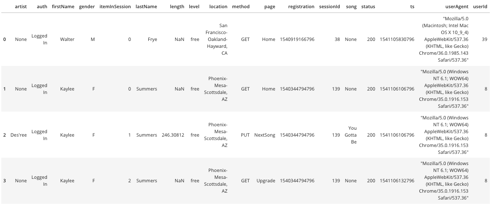
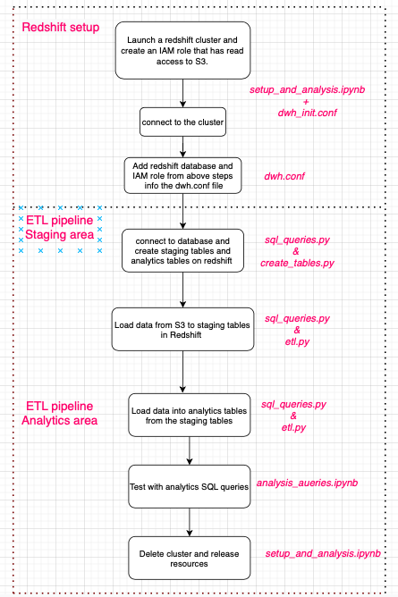
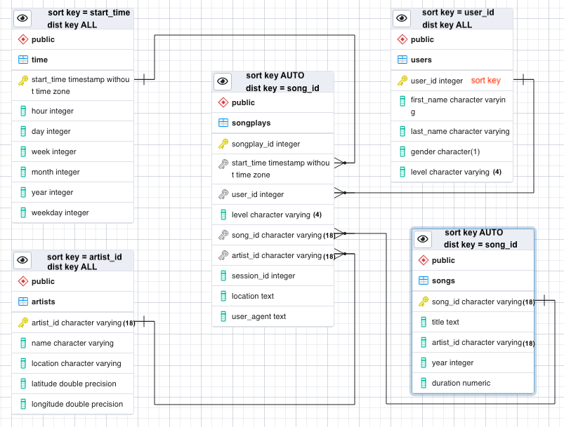

## Introduction and Goal:  
A fictitious music company, Sparkify, offers a music app similar to Spotify. Since the user and song databases have grown over a time, so the company wants to move their process and data onto cloud. For the cloud, they use Aamazon web services. Their data resides in S3 (Simple Storage Service), in a directory of JSON logs on user activity on the app, as well as a directory JSON metadata on the songs in their app.  
As a data engineer, I am going to build an ETL pipleine that extracts the data from S3, stage them in Redshift (data warehouse service in AWS) and transform data into set of dimensional tables so to get insights of data. And we willl also present the comaparison between the schemas with no key distribution style  and with a distribution style.

So to begin we get our the project Datasets:

## Project Dataset files:  

In the project, we will be working with two datasets that reside in S3. Here are the S3 links for each:

- Song data: `s3://udacity-dend/song_data`
- Log data: `s3://udacity-dend/log_data`
- Log data json path: `s3://udacity-dend/log_json_path.json`

### Song Dataset
This is a subset of the real data from the [Million Song Dataset](http://millionsongdataset.com/). Each file is in Json format and contains metadata about a song and the artist of that song. For example:  
`song_data/A/B/C/TRABCEI128F424C983.json  
song_data/A/A/B/TRAABJL12903CDCF1A.json` 

The JSON file contains the following tags. 

|artist_id| artist_latitude| artist_location| artist_longitude| artist_name| duration| num_songs|song_id| title| year|  
|---|---|---|---|---|---|---|---|---|---|  

and looks like
`{"num_songs": 1, "artist_id": "ARJIE2Y1187B994AB7", "artist_latitude": null, "artist_longitude": null, "artist_location": "", "artist_name": "Line Renaud", "song_id": "SOUPIRU12A6D4FA1E1", "title": "Der Kleine Dompfaff", "duration": 152.92036, "year": 0}`

### Log Dataset:  
It contains the details of user activity on the app. The log files in the dataset are partitoned by a year and month. For example: 
`log_data/2018/11/2018-11-12-events.json  
log_data/2018/11/2018-11-13-events.json` 

Each JSON datafile contains the following tags: 

|artist|auth|firstName|gender|itemInSession|lastName|length|level|location|method|page|registration|sessionI|song|status|ts|userAgent|userId|
| --- | --- | --- | --- | --- | --- | --- | --- | --- | --- | --- | --- | --- | --- | --- | --- | --- | --- |

and it looks like

## Procedure:
We have implemented the complete code for Amazon redshift cluster creation, connection and its usage for database creation in this project. For that we have made `dwh_init.cfg` file from which the program reads  the cluster computation node type, their numbers and cluster type. 
After creating Redshift cluster, we use the Cluster role end point and ARN( DWH_ENDPOINT and DWH_ROLE_ARN variable in `setup_and_analysis.ipynb` file) to add into `dwh.cfg` for DWH_CLUSTER_IDENTIFIER and ARN parameters respectively `dwh.cfg` is used in ETL piplines for staging and analytics part. 
Other steps are shown in the below figure.

Database design: 
We choose the star schema for our data modeling of Analytics tables in Redshift since the organisation needs the database for quering purpose which certainly involve aggregations. For fast aggregation, star schema is a better choice than complex ones such as snowflake. Please find the complete analysis in `setup_and_analysis.ipynb` file. The below figure shows the our data model.

### Factors of deciding different distribution and sort key styles:
- songs table and artists table
 - We have decided our disribution style as KEY distribution for song table as the table is biggest with respect to the count of rows. However, analytical team has not given the required analytical queries which must decide the distribution style. Also, we can see the artist table have similar but lower size but we take as AUTO since redshift will decide which should be the best distribution style for the artist table.
 - In addition, song table cotains inherently the artist_id column as well so it should be better taken as distribution style as Key distribution. 
 - **sort key for songs table** is choosen as auto since their might be aggregations where compound keys which work better but in some case compound keys also fails (as per AWS docs). So we best choose AUTO to leave this decison on Redshift.
 - **sort key for artists table** is choosen as artist_id since it will work in agggregations and in cases without aggrgations. Year could be used but
 
- Other tables:
 - Their size is rather small, so we implemented them with "ALL distribution style".
- We also compare results of simple analytics table with no distribution style with the above data model with few sample queries. We find most of the queries run in lower time with our above data model as compared to previous one. Please find the comparison in the last section of `setup_and_analysis.ipynb`.

## file decription:

1. `setup_and_analysis.ipynb` : Jupyter notebook file for
-  Complete implementation of Amazon redshift cluster creation, connection and its usage for database creation,ETL pieline design, table designs and the deletion of cluster and release of resources using boto3 python library .
-  Analysis of datasets to determine the dataypyes of each element in JSON files so to use in Database modelling.
-  Comparison of Table design techniques with and without distribution style of keys in computaion nodes with sample analytical queries.

2. `dwh.cfg` : Set up configuration file with different parameters used for Redshift cluster creationa and connection.

3. `create_tables.py` : python file for create your fact and dimension tables for the star schema in Redshift. 

4. `etl.py`: python file for loading data from S3 into staging tables on Redshift and then process that data into the analytics tables on Redshift

5. `sql_queries.py` : python file for defining SQL statements for creation, insertion and deletion of stagging tables and analytical tables on Redshift. It will be used for above two files.

6. `Analysis_queries.ipynb` : Contains some of sample analytical queries used to test our modelled database.

## How to run the project:  

1. Launch a redshift cluster and create an IAM role that has read access to S3 tha can be done as per steps in `setup_and_analysis.ipynb`/ 

2. Add redshift database and IAM role info to dwh.cfg..

3. Run create_table.py as `python create_tables.py`

4. Load data using etl.py as `python etl.py`

5. Delete Redshift cluster and release resources which can be done as per steps in `setup_and_analysis.ipynb`.

