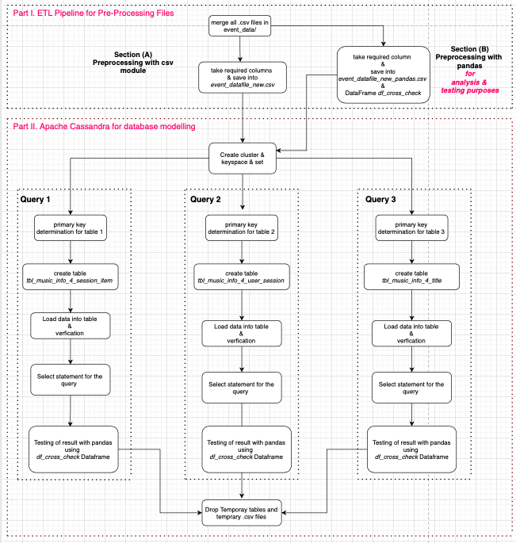

## Introduction and Goal:
A fictitious startup called Sparkify has launched a new music streaming app. Based on the collected data on the user activity, they want to analyse the user behaviour particulary on which songs the users are listening to. For this purpose they need a an Apache Cassandra database model to query the required information for analysis purpose. In this work, we demonstrate the use of Apache cassandra for database modelling with three sample queries to gain insights.  
The three sample queries are as follows.
1. Select the artist, song title and song's length in the music app history that was heard during  sessionId = 338, and itemInSession  = 4
2. Select name of artist, song (sorted by itemInSession) and user (first and last name) for userid = 10, sessionid = 182
3. Select every user name (first and last) in my music app history who listened to the song 'All Hands Against His Own'  

## Packages:
To achieve the goals of the project, we have used `Apache cassandra` as a database platform and `python` as a programing language.
1. Datbase modeling and building ETL pipeline :  we use `csv`, `pandas`, `cassandra` python package. 
2. Testing: We use `pandas` for testing of query results.

## Dataset files:
we have user activity of November 2018 in csv formats (total 30) located in folder `.\event_data\`. Each csv file has the following structure.  

|artist|auth|firstName|gender|itemInSession|lastName|length|level|location|method|page|registration|sessionI|song|status|ts|userAgent|userId|  
| --- | --- | --- | --- | --- | --- | --- | --- | --- | --- | --- | --- | --- | --- | --- | --- | --- | --- |  

## Procedure: 

### Data model diagram:  


### Part I: ETL pipeline:  

**Extraction** : We use `csv` python module and `pandas`.
1. Merging all files into a single csv file.
2. Take required column fields and save into a single csv file.
3. save the files into Pandas dataframe for anaysis and testing purposes.

### Part II: Database model with Cassandra:

**Load into tables** : 
1. Determine Primary key for tables.
2. Creation of required tables using cassandra python driver package.
3. Load data into the tables with `csv` python module or with `pandas`. We have used single line insertion method. We have used `pandas` for comparison purposes of efficiency.

**Selection of data** :
1. Select data with proper select command
2. Test the data with Pandas dataframe (named as `df_cross_check`)

## file decription:

1. `./event_data` : as decribed in dataset section.

2. `Project_cassandra.ipynb` : Jupyter notebook file for the project.

3. Intermediate Temporary file `event_datafile_new.csv` : a collective csv file  with required fields after merging of all .csv data files in /event_data directory. It is generated during program execution. 

4. Intermediate Temporary file `event_datafile_new_pandas.csv` : a collective csv file  with required fields after merging of all .csv data files in /event_data directory. Only for validation purpose with csv python module results. It is generated during program execution. 


## How to run the project:  
Execute `Project_cassandra.ipynb` file.


## References and links:

####  os.walk output:
https://www.tutorialspoint.com/python/os_walk.htm  

#### Python i/o operations:
https://www.tutorialspoint.com/python/python_files_io.htm  

#### Pandas row operations
https://www.interviewqs.com/ddi-code-snippets/rows-cols-python

#### Creating Function in cassandra

https://docs.datastax.com/en/cql-oss/3.3/cql/cql_using/useCreateUDF.html

https://www.youtube.com/watch?v=ujEv_rmgcME

#### insertion in cassandra   
https://docs.datastax.com/en/dse/5.1/cql/cql/cql_using/whereClustering.html


## Notes:
#### Creating Function in cassandra
In cassandra.yaml - set enable_user_defined_functions=true to enable"

``` CQL
query_func = """
CREATE OR REPLACE FUNCTION IF NOT EXISTS concat_name(first_name text, last_name text)
CALLED ON NULL INPUT
RETURNS TEXT
LANGUAGE java
AS
'
String name;
name = first_name + " " + last_name;
return name; '
; """
```

#### For selecting table names from keyspace
``` CQL
session.execute("SELECT * FROM system_schema.tables WHERE keyspace_name = 'project_nosql';") 
```

#### Related to glob.glob
https://docs.python.org/3/library/glob.html  

The glob module finds all the pathnames matching a specified pattern according to the rules used by the Unix shell, although results are returned in arbitrary order.  
 glob.glob(pathname, *, root_dir=None, dir_fd=None, recursive=False)  

``` python
import glob
glob.glob('./[0-9].*')  
['./1.gif', './2.txt']  

glob.glob('*.gif')  
['1.gif', 'card.gif']  

glob.glob('?.gif')  
['1.gif']  

glob.glob('**/*.txt', recursive=True)  
['2.txt', 'sub/3.txt']  

glob.glob('./**/', recursive=True)  
['./', './sub/'] 
```


