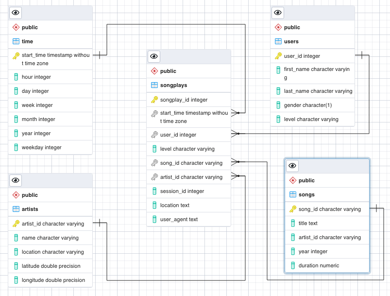
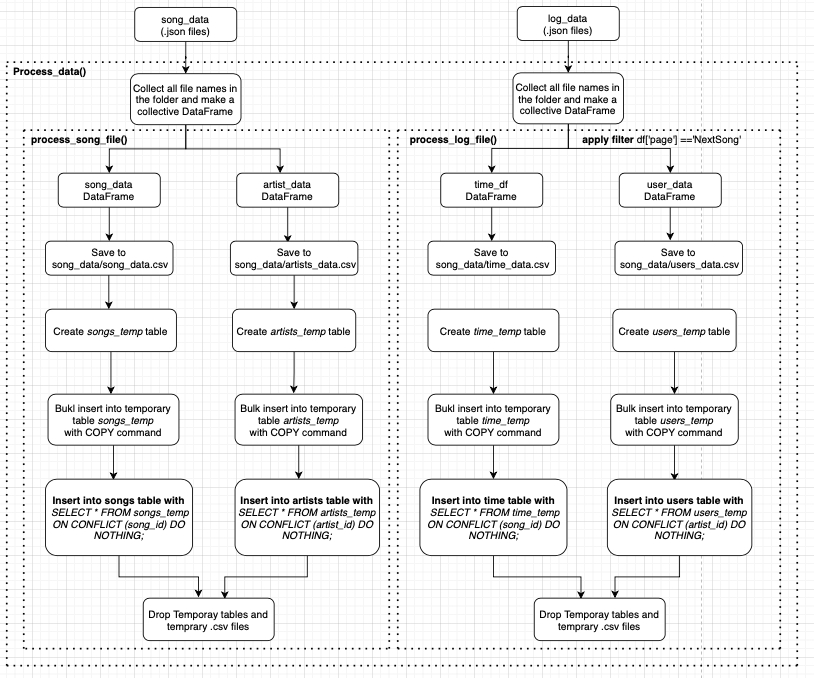
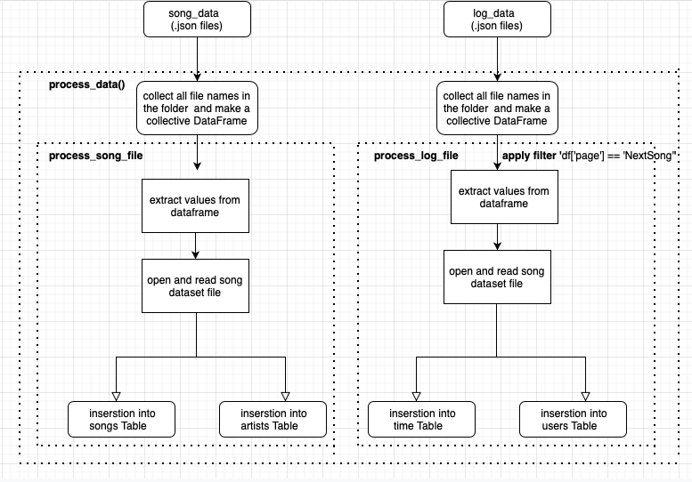

## Introduction:
A fictitious startup called Sparkify has launched a new music streaming app. Based on the collected data on the user activity, they want to analyse the user behaviour particulary on which songs the users are listening to. For this purpose they need an optimised database model to query the required information for analysis purpose. 

## Goal:
To achieve the goals of the project, we have used `postgresql` as a database platform and `python` as a programing language.
1. Data modeling in postgresql :  we use __STAR schema__
2. Build ETL pipeline: we use __psycopg2 python package__

**Why star schema**: 
1. The dataset which we are dealing is not complex and we do not need a transactional data where we need data to be highly normalised in relational format.
2. The organisation requires read only reports or query fetch for analysis. Star schema will certainly give higher performance since it supports less complex queries than highly normalised database. 
3. Since the organisation needs the database for quering purpose which certainly involve aggregations. For fast aggregation, star schema is a better choice than complex ones such as snowflake.  

## Dataset files:
1. `song_data.json` : Details of songs present in the app.   

|artist_id| artist_latitude| artist_location| artist_longitude| artist_name| duration| num_songs|song_id| title| year|  
|---|---|---|---|---|---|---|---|---|---|  

2. `log_data.json` : Details of user activity on the app.

|artist|auth|firstName|gender|itemInSession|lastName|length|level|location|method|page|registration|sessionI|song|status|ts|userAgent|userId|
| --- | --- | --- | --- | --- | --- | --- | --- | --- | --- | --- | --- | --- | --- | --- | --- | --- | --- |

## Data model diagram:  
Below is the ERD diagram of the tables

## ETL Pipeline:
We discuss and use two ways for data load into tables.  
1. Bulk or multi-row insertion direclty from the saved file. 

2. row wise insertion from the DataFrame

###  1. Bulk or multi-row insertion  

### 2. For row wise insertion from the DataFrame  

## Procedure and file decription:

1. __Dataset analysis with pandas:__  
Read files and data analysis with pandas:  `dataset_analysis.ipynb`
2. __Data modelling:__
  1. Build statements contains table creation, insertion, drop statements used in "create_tables.py" : `sql_queies.py` or `./single_row_insertion/sql_queies.py`
  2. Drop and create tables: `create_tables.py` or`./single_row_insertion/create_tables.py`
3. __Build ETL pipeline:__  
Load and process the dataset files and insert into created tables in above step:
  1. Jupyter notebook file to develop the ETL process to load the whole datasets : `etl.ipynb`
  2. Consolidate the work of etl.ipynb into python file with functions for ETL: `etl.py` or `./single_row_insertion/etl.py`    
4. __Testing:__  
Test the table structures, counts and data in data : `test.ipynb` or `./single_row_insertion/test.ipynb`  
5. __Getting insights with our designed datamodel(SQL):__
Sample data queries from the constructed data model : `Analsis_queries.ipynb`

## How to run the project:  
### For Bulk insertion:

1. `python create_tables.py`
2. `python etl.py`

### For row wise insertion:

1. `cd single_row_insertion/`
2. `python create_tables.py`
3. `python etl.py`

## Useful Links:
On conflict: https://www.youtube.com/watch?v=7yscNEvrrew

Numeric data types: https://www.postgresql.org/docs/current/datatype-numeric.html
    
Double precision data type: https://kb.objectrocket.com/postgresql/how-to-use-the-postgresql-double-precision-type-1435

user input with select statement: https://stackoverflow.com/questions/51656756/python-postgresql-select-user-input

Serial-function with insertion: https://stackoverflow.com/questions/12836043/inserting-a-record-into-a-table-with-a-column-declared-with-the-serial-function

Null and NaN: https://medium.com/@allenhuang1996/whats-the-difference-between-null-and-nan-in-python-a1af20d523ce

SQL Nulls: https://www.geeksforgeeks.org/sql-null-values/

Pandas unique: https://www.geeksforgeeks.org/get-unique-values-from-a-column-in-pandas-dataframe/

Missing data in pandas: https://www.geeksforgeeks.org/working-with-missing-data-in-pandas/

Pandas to postgres: https://medium.com/analytics-vidhya/part-4-pandas-dataframe-to-postgresql-using-python-8ffdb0323c09  

Null Handeling: https://stackoverflow.com/questions/45892420/postgresql-copy-empty-string-as-null-not-work/56393289#56393289

About cursor.execute(query, parameters) : https://linuxhint.com/cursor-execute-python/
